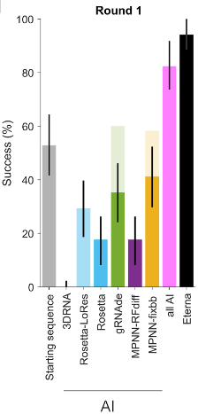
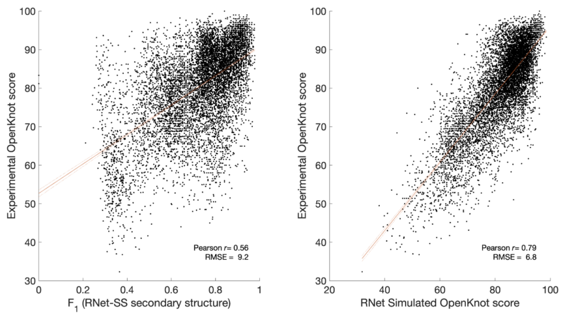
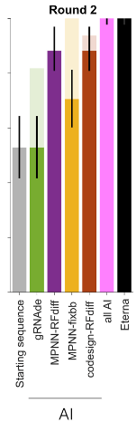
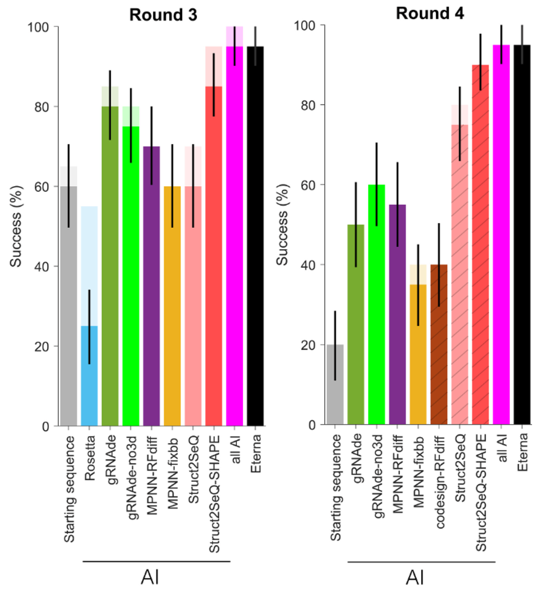

> **Paper brief**: Townley and colleagues report a de novo RNA design study in *Science*. In Eterna's OpenKnot challenge, several deep-learning methods and experienced human designers tackled the same set of 57 pseudoknot targets. With experimental feedback and RNet-assisted screening, AI reached human-level performance on most blind targets; three designs also formed ordered three-dimensional folds resolved by cryo-EM.[^paper]

## Why is RNA structure design difficult, and what makes pseudoknots harder?

RNA secondary structure is defined by base pairing between nucleotides. To make a sequence fold stably into a target, designers must favor the intended pairs while avoiding competing folds. Pseudoknots add crossing pairings and longer-range interactions, leaving a narrower sequence space.

## From a target structure to candidate sequences

OpenKnot gave designers a target secondary structure specifying which positions should pair, which should remain single-stranded, and how the stems and loops connect. Six computational methods entered the first round. Their inputs and generation strategies differed: some designed directly from secondary structure, while others also required an experimentally resolved or computationally modeled 3D backbone.

Once candidates had been generated, RNet served as a pre-experiment filter rather than a sequence generator. It predicted a nucleotide-resolution SHAPE reactivity profile from each sequence and estimated whether that profile agreed with the target secondary structure. Designers could therefore prioritize candidates more likely to form the target before synthesizing any RNA.

That distinction matters. The study did not let one computational model serve as the final judge of another model's output. RNet narrowed the search space; SHAPE, compensatory mutagenesis, and cryo-EM provided increasingly stringent experimental tests.

## OpenKnot: AI and human designers in the same experiment

OpenKnot asked AI methods and Eterna community designers to solve the same targets, then synthesized and measured their candidates under common conditions. Its main screening metric, the OpenKnot score, ranges from 0 to 100 and measures whether experimental SHAPE reactivity matches the target structure's expectations: paired positions are generally less reactive, while flexible or unpaired positions are generally more reactive. The paper defined a score above 90 as success.

This score supports high-throughput comparisons, but it is not a direct readout of base pairing. Low reactivity can also result from stacking, local occlusion, or an alternative fold. A score above 90 therefore means that the experimental signal is highly compatible with the target—not that every intended base pair has been proved.

### Round 1: human designers lead

The first round contained 17 pseudoknot targets: 11 drawn from RNAs with experimentally determined 3D structures and six synthetic pseudoknots proposed by Eterna participants. Six computational methods and human designers submitted candidates for SHAPE measurements. Eterna participants performed better overall, while most AI methods did not consistently cross the 90-point threshold.

*Round 1: success rates across 17 targets*

The “starting sequence” in the figure is the reference sequence associated with each target. It may be a natural RNA or an earlier design, and it is not guaranteed to form the target pseudoknot under the measurement conditions. OpenKnot's SHAPE experiments omitted small-molecule ligands; natural RNAs that depend on a ligand to stabilize their target fold could therefore score poorly. A new design could outperform the natural sequence by stabilizing the intended pairs without a ligand.

### Round 2: bringing experimental feedback back into design

After Round 1, the researchers found that simulated scores derived from RNet-predicted SHAPE profiles correlated strongly with experimental scores. RNet could therefore filter out clearly unsuitable candidates before experiments. Round 2 reused the same 17 targets: Eterna players received an interactive RNet tool, and AI methods incorporated RNet into their screening pipelines.

*Correlation between RNet-derived metrics and experimental OpenKnot scores*

Both AI and human performance improved markedly. Among the targets for which each group submitted designs, every tested AI method and the Eterna participants found a sequence scoring above 90 for at least 80% of targets, with no statistically significant differences between methods.

*Round 2: success rates after RNet-assisted screening*

### Rounds 3 and 4: new targets and longer RNAs

Improvement on the same puzzles could simply reflect repeated trial and error. To test generalization, Rounds 3 and 4 introduced 20 new targets each; Round 4 covered RNAs from 117 to 240 nucleotides long. Across all four rounds, the challenge included 57 distinct targets.

The gains survived the shift to new puzzles. When grouped by designer type, both AI methods and Eterna designers solved 19 of 20 targets in Round 3 and 19 of 20 in Round 4. For the longer Round 4 targets, starting sequences crossed the 90-point threshold in only four of 20 cases, making it unlikely that success came from simply preserving natural sequences.

*Rounds 3 and 4: success rates on new targets*

## Three layers of evidence: from a matching signal to a formed structure

### 1. SHAPE: does the global pattern match the target?

SHAPE chemical mapping records RNA reactivity nucleotide by nucleotide. Stable paired positions generally show lower reactivity, whereas flexible, unpaired positions generally show higher reactivity. If the measured pattern agrees with the target structure, the global pairing pattern is consistent with the design.

SHAPE cannot directly identify a nucleotide's pairing partner, however. Low reactivity alone cannot rule out stacking, local occlusion, or an alternative fold. It is a powerful screening assay, but not sufficient by itself to confirm specific base pairs.

### 2. M2R-seq: are the intended base pairs really present?

The researchers next used mutate-map-rescue sequencing (M2R-seq) to test Round 3 designs. If two positions pair as intended, mutating either one should disrupt the pair and perturb the nearby SHAPE signal. Mutating both positions to restore complementarity should then restore the original signal. This disruption-and-rescue response provides more direct evidence for a specific pair than a SHAPE profile alone.

Of the 20 Round 3 targets, 17 had at least one design for which M2R-seq supported every target stem. At the less stringent threshold of at least 80% stem-wise recovery, 19 targets had at least one qualifying AI or Eterna design. By that criterion, AI and Eterna success rates were 90% and 75%, respectively, a difference that was not statistically significant.

### 3. Cryo-EM: what 3D conformation accompanies the target pairs?

SHAPE and M2R-seq supported the target secondary structure, but they could not resolve the complete 3D topology. The researchers therefore used cryo-EM to analyze three AI designs. All three formed the target stems and exhibited noncanonical interactions that had not been explicitly specified during design. Cryo-EM thus moved the evidence from “the target pairs form” to a direct view of the 3D conformation.

The result is striking: methods focused mainly on secondary structure can still produce RNAs that settle into ordered 3D folds through the molecule's physical constraints. But it does not mean that the 3D structure problem has been solved. Another imaged design formed a dimer, placing one intended “kissing” interaction between two RNA molecules rather than within one; four additional candidates appeared aggregated or unfolded during purification and did not proceed to microscopy.

## What is the significance and scope of this work?

RNA secondary-structure inverse folding is not a new problem. The value of this work is that it establishes a common experimental benchmark in which several deep-learning methods are tested under the same conditions, directly relating model predictions to experimental measurements. For complex pseudoknots, AI designs can form the intended pairs experimentally, and cryo-EM provides 3D structural evidence for a few representative designs.

Accurate secondary-structure prediction, combined with experimental measurements, can already advance part of the de novo RNA design problem. This study did not test functions such as catalysis or ligand recognition, which depend on precise tertiary interactions; those functions will require more direct 3D modeling and functional experiments.

[^paper]: Townley, J. et al. “De novo design of RNA pseudoknots with deep learning.” *Science* 393, 931–937 (2026). DOI: [10.1126/science.aeg6829](https://doi.org/10.1126/science.aeg6829).
