> **论文速览**：Koehl 等人在这篇 bioRxiv 预印本中提出深度学习框架 PEINT（Protein Evolution IN Time），用于显式学习“蛋白质如何随时间演化”。它不再把每个氨基酸位点视为彼此独立的骰子，而是将完整序列之间的进化转移建模为序列到序列任务，直接从未对齐的序列中学习插入、缺失及位点间的协同变化。PEINT 不仅能更准确地拟合已观察到的进化转移，还能沿系统发育树生成新颖度很高、同时保留结构与功能特征的蛋白质序列。[^paper]

## 蛋白质进化模型，为什么要从“一个位点一个位点”升级？

蛋白质序列的演化看似由一次次氨基酸替换组成，但蛋白质的结构和功能从来不是由各个位点独立决定的。一个位点发生突变后，远处的另一个位点可能需要随之补偿；插入或缺失一个残基，也可能改变后续区域的几何关系。这类相互依赖通常被称为上位性（epistasis）。

WAG、LG 等经典蛋白质进化模型为了让系统发育计算可行，通常使用连续时间马尔可夫链描述单个位点的替换概率。不同位点可以有不同速率，但在给定模型下，位点之间基本独立演化。这个近似很实用，却有两个明显边界：

- 它难以表达“这个突变是否适合当前序列背景”；
- 它通常依赖预先对齐的序列，并不自然地描述插入和缺失。

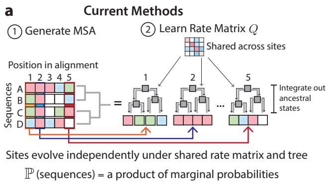

*替换概率示意图*

如果把序列看成一句话，独立位点模型就像逐词翻译：每个词单独替换，却不检查整句话是否仍然通顺。蛋白质进化模型真正需要的是另一种能力：改变局部序列之后，仍能维持全局的结构与功能约束。

## PEINT 的核心：把进化写成“带时间条件的序列翻译”

PEINT 的思路可以用一个问题概括：给定起始序列 $x$ 和进化时间 $t$，后代序列 $y$ 出现的概率是多少？也就是学习 $p(y\mid x,t)$。这里的 $t$ 对应系统发育树上的分支长度，可以理解为两条序列之间积累的进化距离。

研究中的系统发育树来自作者使用的蛋白质家族数据。多序列比对先把不同蛋白质中大致对应的氨基酸放在同一列；FastTree 2 再根据这些列中的相似与差异，寻找最能解释序列关系的树，估计序列之间的进化距离，最终得到近似最大似然的系统发育树。

在每个家族的树中，实际观测到的序列位于叶节点，树的分叉结构则表示这些序列之间推断出的亲缘关系。

有了这棵树，作者把训练问题拆成许多更小的任务：从树上选取一对亲缘较近的序列，记录它们之间的进化距离，让模型学习“给定一条序列和进化时间，另一条序列可能是什么样”，再用这些样本构造训练目标。这样做有两个好处：

1. 模型可以直接学习从一条完整序列到另一条完整序列的转移；
2. 转移不再要求两条序列在多序列比对中逐列对应，因此模型可以从原生、未对齐的序列中学习插入和缺失。

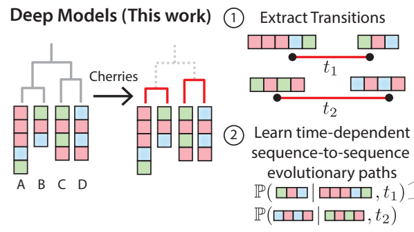

*PEINT 思路示意图*

模型本身采用耦合的编码器—解码器 Transformer，形式上类似机器翻译：编码器读取起始蛋白，解码器在给定 $t$ 的条件下逐步生成后代序列。最终版本以冻结的 1.5 亿参数 ESM2 表征为基础，增加约 5700 万个可训练参数，并同时执行输入序列的掩码语言建模和目标序列的自回归生成任务。

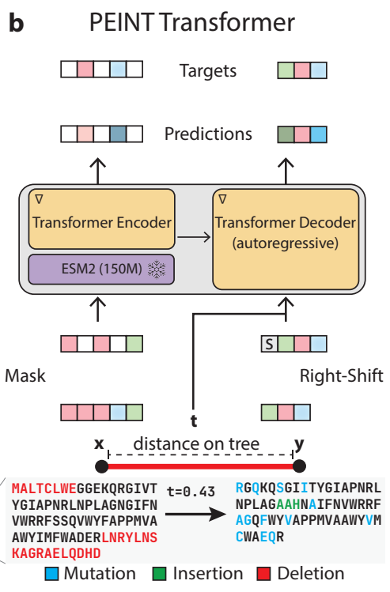

*PEINT 的 Transformer 架构示意图*

## 数据设计：从蛋白质家族中提取“进化转移”

作者使用 trRosetta 数据集中的约 15,000 个蛋白质家族多序列比对来学习进化转移。[^trRosetta]

为了检验泛化能力，研究采用了两种划分方式。约 550 个家族完全留作测试，用来判断模型能否泛化到从未见过的家族；其余约 14,500 个家族则进行“家族内留出”。作者没有随机切分序列，而是在每个家族的系统发育树上寻找一条较早的分支，将树分成序列数量大致相当的两个子树：一棵用于训练，另一棵用于测试。两棵子树属于同一家族，却代表相对独立的进化路径。这种设计可以检验模型见过一个家族后，能否继续泛化到其中未见过的序列。

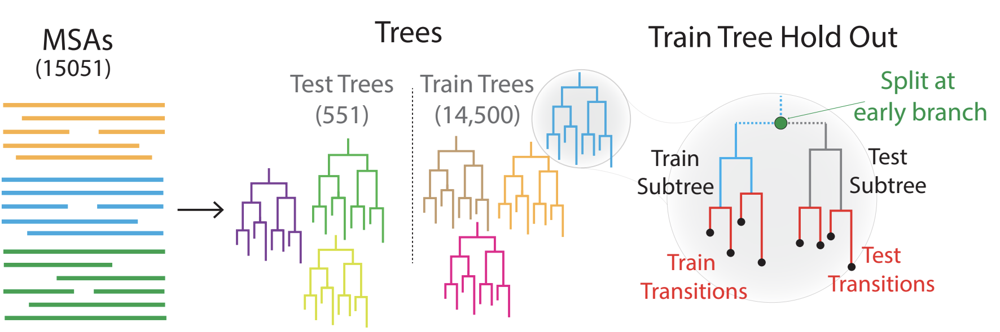

*数据划分示意图*

## 三层证据：拟合更好、时间估得准、生成更像自然序列

### 1. PEINT 更好地解释蛋白质序列的进化变化

为了测试模型能否解释真实的序列变化，作者从系统发育树中取出一对序列：将其中一条作为起始序列，把两条序列之间的进化距离告诉模型，再让模型为另一条真实序列打分。这个分数就是转移似然；分数越高，表示模型认为“从起始序列经过这段进化距离到达目标序列”越合理。作者在家族内留出和完全未见家族两种设置下，用相同的序列对与进化距离比较 PEINT、WAG 和 LG。

在两类测试设置中，PEINT 的转移似然都高于 WAG 和 LG，而且在不同的进化距离下都保持优势。

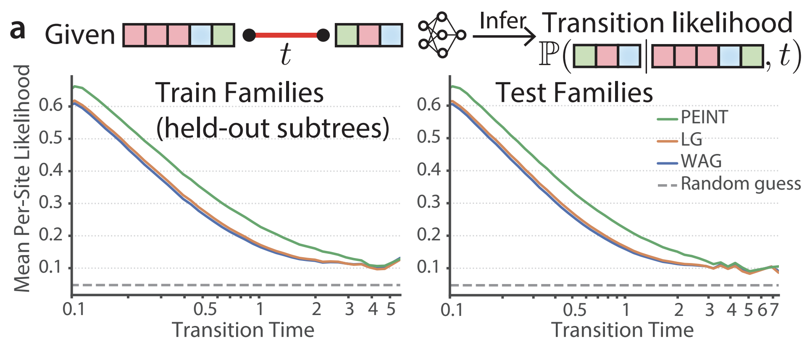

*转移似然比较*

### 2. PEINT 可以从序列对估计进化时间

进化模型不仅可以根据给定的时间生成序列，也可以反过来估计两条序列之间经历的进化时间。给定序列 $x$ 和 $y$，作者把 $t$ 视为待估参数，将两个方向的转移似然相加，得到总分 $S_t = p(y\mid x,t) + p(x\mid y,t)$。

其中，$p(y\mid x,t)$ 表示从 $x$ 出发、经过时间 $t$ 生成完整序列 $y$ 的可能性，$p(x\mid y,t)$ 则表示反向转移的可能性。论文观察到，似然随 $t$ 变化的曲线呈凹形，因此可以用梯度上升寻找 $S_t$ 的峰值。作者随机选取 150 个测试家族进行评估；PEINT 估计的进化距离与经典模型的结果高度相关，Pearson 相关系数达到 $r = 0.95$。

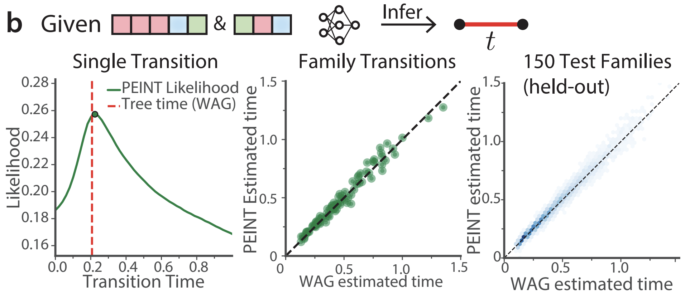

*左：单个序列对的似然随进化时间变化；中：单个测试家族的进化距离估计；右：150 个测试家族的进化距离估计。*

### 3. 在相同突变负荷下，生成序列的结构置信度明显更高

作者选定同一条起始序列，让 PEINT、WAG 和 LG 分别在不同进化时间下生成一批序列，再用 OmegaFold 等单序列结构预测方法评估结构置信度。

三类模型生成序列的平均突变数量都会随时间增加。真正拉开差距的是，序列积累这些突变后能否保持较高的结构可信度。PEINT 在超过一个进化时间单位后，平均折叠置信度仍然较高，此时起始蛋白约有一半的位点已经改变；WAG 和 LG 在较长时间尺度上则出现明显的结构质量下降。

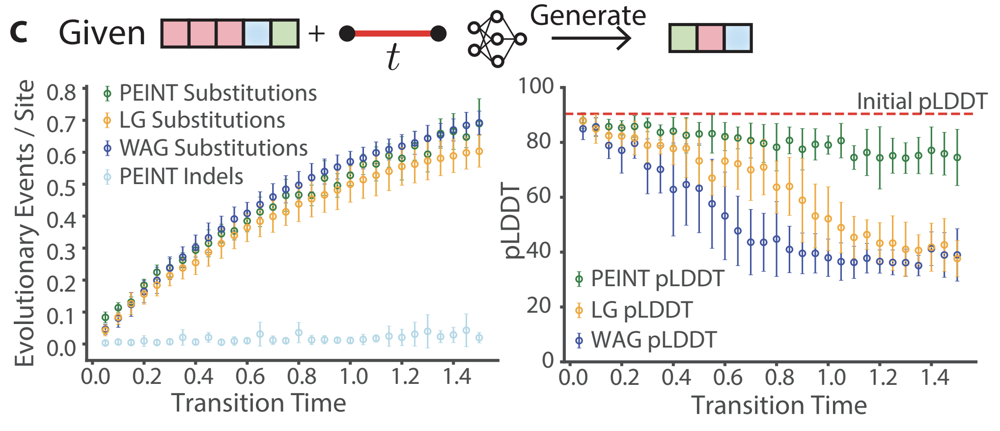

*左：单个起始序列的突变负荷随进化时间变化；右：单个起始序列生成后代的结构置信度随进化时间变化。*

一种合理的解释是，PEINT 学到了补偿性突变：一个位置改变后，解码器会根据新的序列背景，在其他位置引入有助于维持接触关系的变化。这正是独立位点模型难以表达的“成套突变”。

## 沿整棵树“重播”进化：多代生成后还能否保持自然蛋白特征？

真实的蛋白质家族沿系统发育树经历连续多代变化。因此，更具挑战性的测试是让模型从根节点出发，沿树逐层生成子节点，最后观察叶节点是否仍像自然演化产生的蛋白质。

作者从完全留出的测试家族中选取约 550 棵系统发育树进行整树模拟。对每棵树，他们先选择一条长度处于该家族中位数的真实序列作为新根节点，再沿树逐步生成后代序列。

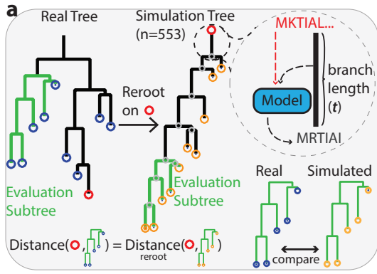

*蛋白质进化模拟*

### 保守位点的氨基酸模式

以人类 TRAAK 机械敏感离子通道为例，作者先在同源序列的多序列比对中找出保守度超过 75% 的位点，再比较真实评估序列与模型生成序列在这些位点上的氨基酸分布，并用 Jensen–Shannon 散度衡量差异。数值越小，生成模式就越接近真实序列。结果显示，PEINT 对真实分布的还原优于 WAG 和 LG；同样的趋势也出现在其余 545 棵留出树中。

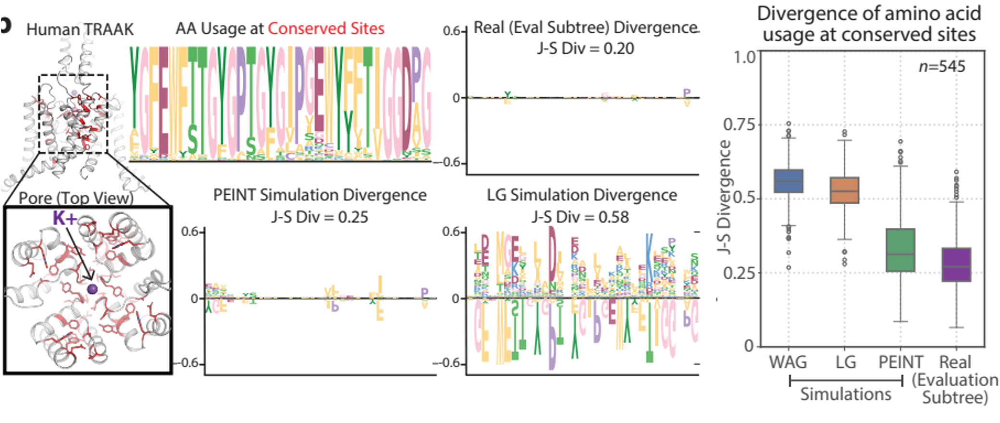

*左：PEINT 能捕捉人类 TRAAK 的保守模式；右：545 个留出家族中保守位点的 Jensen–Shannon 散度。*

### 插入与缺失模式

蛋白质进化还会改变序列长度。PEINT 生成的后代序列可以通过插入或删除氨基酸而变长或变短。要统计每条分支上发生了多少插入或缺失，首先需要知道祖先节点的序列；但真实数据通常只提供叶节点序列，因此作者使用 Historian 根据真实序列和树结构估计这些统计量，再与模拟结果比较。PEINT 不仅重现了不同蛋白质家族特有的插入、缺失频率，也重现了单次长度变化通常涉及的氨基酸数量。

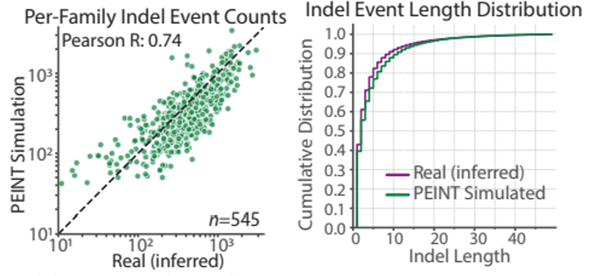

*左：插入、缺失事件的发生频率；右：单次事件的长度分布。*

### 结构置信度

作者在每个模拟家族中随机抽取 30 条叶序列，分别用 AF2Rank 和 OmegaFold 预测结构，并以这些序列的 pLDDT 中位数作为家族层面的结构置信度。PEINT 叶序列的 pLDDT 接近真实序列，并显著高于表现最好的经典模型。

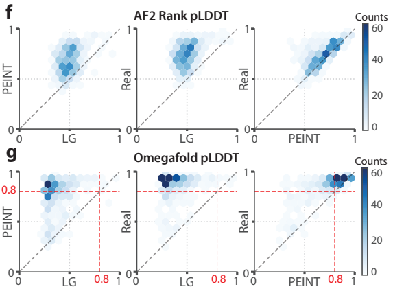

*结构预测模型的置信度比较*

作者还进行了基于多序列比对的评估：把每个模拟家族的叶节点序列整理成多序列比对，再直接输入 AlphaFold2 预测结构。由 WAG 和 LG 模拟序列构建的多序列比对得到的结构置信度较低；PEINT 生成结果的置信度接近、但仍略低于真实序列。

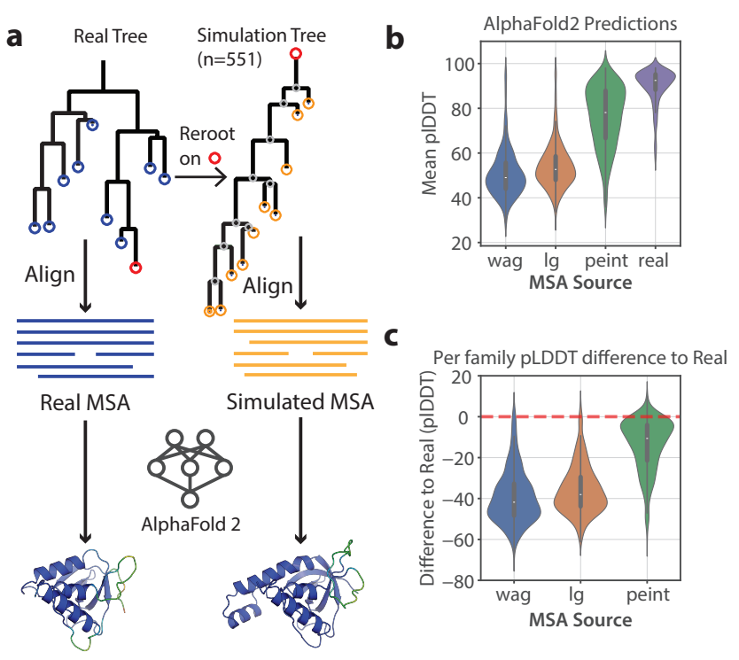

*AlphaFold2 基于模拟多序列比对得到的结构置信度。*

## 实验验证：模拟序列仍保留碳酸酐酶活性

为了检验沿进化轨迹生成的序列是否真的保留活性，作者以豌豆（*Pisum sativum*）β-碳酸酐酶为起点，让 PEINT 和 LG 在同一棵树上不经筛选地生成序列，再选取模拟叶节点进行实验。

在包含锌离子的结构预测中，这些序列都能形成催化所需的配位几何，而周边区域则出现更多序列与结构变化。与 NCBI 非冗余数据库比较时，两种模型生成的大多数叶序列与最接近的已知基因只有约 40%–50% 的序列一致性。

作者随后从 PEINT 模拟树中随机选取 20 个叶节点进行实验表征，并把这些序列放入缺失碳酸酐酶的菌株中做功能互补。D152N 被用作功能受损的对照突变体：该突变会影响催化过程中的质子转移，只保留很弱的活性。20 条设计序列中，有 6 条恢复生长的能力优于 D152N。换句话说，这些序列虽然已经远离起始的野生型蛋白，却仍保留了部分碳酸酐酶活性。

## PEINT 还能预测突变效应

自然蛋白质家族记录了长期选择留下的变化。对这些序列关系建模，不仅可以模拟进化，也可以用于判断新突变是否符合家族的进化约束。

作者使用 ProteinGym 为这些家族提供的多序列比对，沿用前述流程推断系统发育树并提取进化转移。针对替换突变基准中的 201 个家族，他们从每个家族选取 1,000 个进化转移，训练一个较小的 PEINT：以 1.5 亿参数 ESM2 的表征为基础，再增加约 2300 万个可训练参数。与单独使用 ESM2 相比，PEINT 在不同类型的深度突变扫描任务上表现更好；当突变体与野生型相差超过两个氨基酸位点时，提升尤其明显。

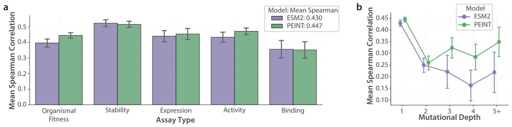

*左：ProteinGym 变异效应预测基准；右：PEINT 对多突变体的预测提升更明显。*

作者还把编码器换成 6.5 亿参数的 ESM2，并重新训练 PEINT。6.5 亿参数 ESM2 的零样本表现优于 1.5 亿参数版本；以它为基础的 PEINT 在突变效应预测上也进一步提升。

## PEINT 的机制线索：位点耦合与序列对应

为了理解 PEINT 如何利用序列中的相互作用，作者使用类别雅可比（categorical Jacobian）进行逐位点扰动分析：依次改变输入序列或解码器已经生成的氨基酸，观察这种改变如何影响模型在其他位置的输出。

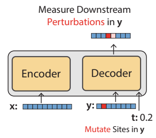

*逐位点扰动分析示意图*

论文以 PDB 4K6E 的输入序列为例，将类别雅可比矩阵与该序列的结构接触图对照。模型识别出的前 $L$ 个最强耦合中，对应结构接触的残基对标为蓝色，其余标为红色，从而直观呈现模型耦合与真实结构接触的一致程度。

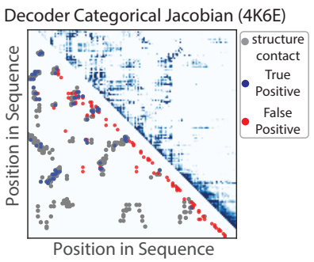

*右上：类别雅可比矩阵；左下：结构接触图。叠加结果中，灰色表示结构接触，蓝色表示真阳性，红色表示假阳性。*

在更大规模的分析中，作者汇总了测试家族中 553 条序列的结果，比较 PEINT 解码器与仅含编码器的 ESM 模型在前 $L$ 个类别雅可比耦合上的 Precision@$L$，即其中属于真实结构接触的比例。结果显示，PEINT 解码器中最显著的耦合确实与结构相关，但这种相关性弱于 ESM。

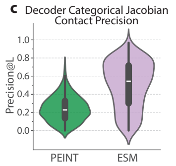

*PEINT 解码器与 ESM 的 Precision@$L$ 比较。*

作者还考察了编码器与解码器之间的跨模块类别雅可比耦合。这些耦合与成对序列比对的轨迹矩阵高度相似，说明模型在解码时会将待生成序列与起始序列的表示对齐。这种对齐能力可能是 PEINT 建模进化转移的重要来源之一。

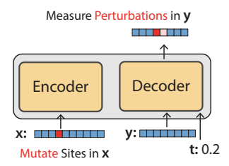

*编码器扰动分析示意图*

为了具体展示这种对齐信号，作者从一个 Pfam 种子比对中选取序列对作为例子。灰色方块表示 Pfam 提供的参考比对；上方是 Needleman–Wunsch 的结果，绿色表示正确对齐，红色表示错误对齐；下方是 PEINT 编码器—解码器之间的类别雅可比，颜色同样表示对齐是否正确。插图给出插入残基区域的原始类别雅可比值，提示缺口附近存在“软对齐”。

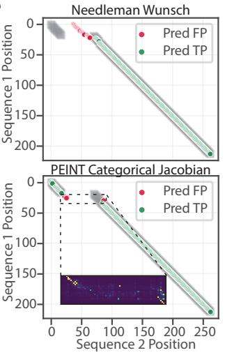

*Pfam 序列对中 Needleman–Wunsch 与 PEINT 对齐结果的比较*

作者还在 1,000 个随机选取的 Pfam 结构域种子比对上汇总评估预测比对的 F1，并以参考 Pfam 比对中的成对序列一致性为横轴。PEINT 的比对 F1 随序列一致性提高而上升，整体接近 Needleman–Wunsch，尽管模型从未被直接训练来执行序列比对。

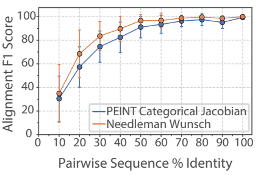

*由 PEINT 类别雅可比得到的比对与 Needleman–Wunsch 的 F1 比较。*

## 两个需要注意的限制：时间标签与时间方向

PEINT 的时间标签来自由多序列比对推断的系统发育树与分支长度，但模型实际学习的是从 UniProt 取回的完整序列之间的转换。换句话说，研究者用根据核心比对区域确定的 $t$ 来描述全长序列之间的转换。这个 $t$ 是否同样适合刻画完整序列的进化距离，论文尚未通过全长序列模拟或其他专项分析检验。

此外，PEINT 虽然能根据不同的 $t$ 生成不同程度的序列变化，但它学到的更接近“序列在进化空间中走了多远”，而不是从具有历史顺序的观测中学习“从过去走向未来”的方向。也就是说，PEINT 已经较好地捕捉了进化约束，却还没有真正学习进化的“时间箭头”。

## 这项工作的真正价值：把“蛋白质语言”接回时间

蛋白质语言模型擅长从海量序列中学习统计规律，蛋白质设计模型擅长在序列空间中提出候选，经典进化模型则提供明确的时间与树结构。PEINT 的贡献，是把这三类能力连接起来：

- 它保留了深度模型表达高阶序列依赖的能力；
- 它把进化时间作为可解释的条件变量，而不是把所有序列混在一起学习；
- 它允许模型从一条序列出发，按进化时间沿系统发育树逐步生成后代；
- 它可以把家族特异的进化信息用于变异效应预测。

因此，PEINT 至少有三类潜在用途：为系统发育方法提供更逼真的模拟数据；帮助研究者在受控条件下“重播”或扰动蛋白质家族的进化；为机器学习引导的蛋白质工程提供结构约束更强的候选起点。

[^paper]: Koehl, A. et al. “Deep models of protein evolution in time generate realistic evolutionary trajectories and functional proteins.” *bioRxiv*, 2026.02.19.706898v1. DOI: [10.64898/2026.02.19.706898](https://doi.org/10.64898/2026.02.19.706898)。本文讨论的是尚未经过同行评审的预印本；后续版本可能更新数据、分析或表述。
[^trRosetta]: Yang, J. et al. “Improved protein structure prediction using predicted interresidue orientations.” *PNAS* 117, 1496–1503 (2020). DOI: [10.1073/pnas.1914677117](https://doi.org/10.1073/pnas.1914677117)。[trRosetta 数据与多序列比对](https://yanglab.qd.sdu.edu.cn/trRosetta/benchmark/)。
