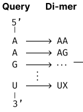
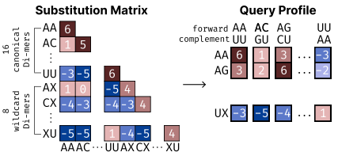
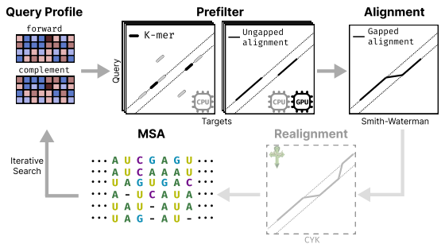
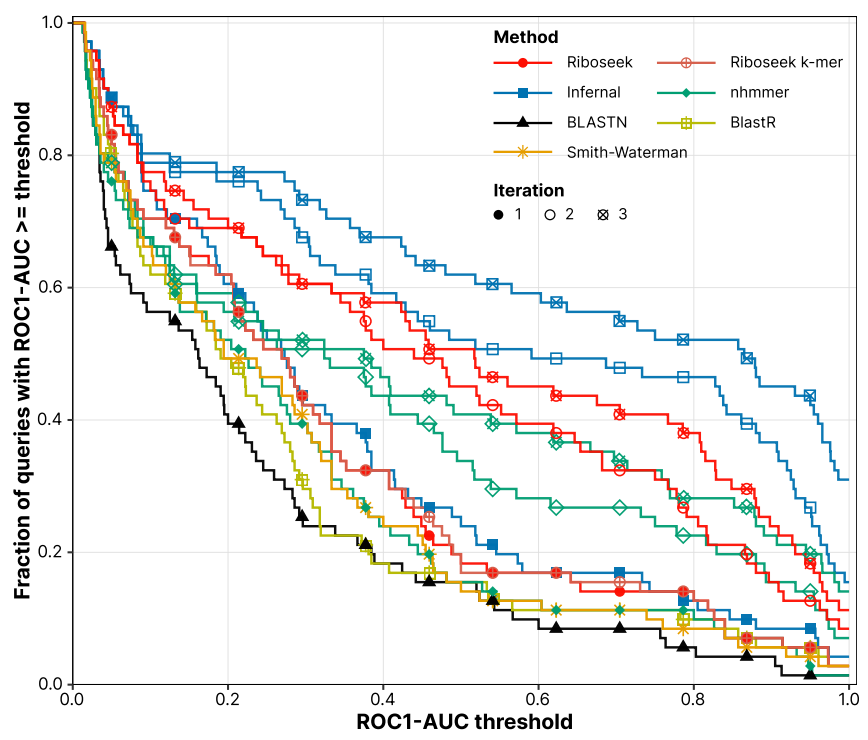
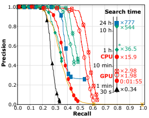
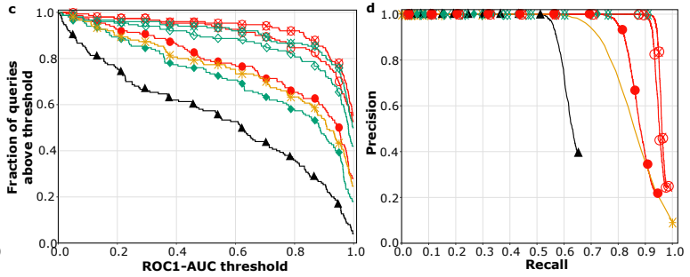
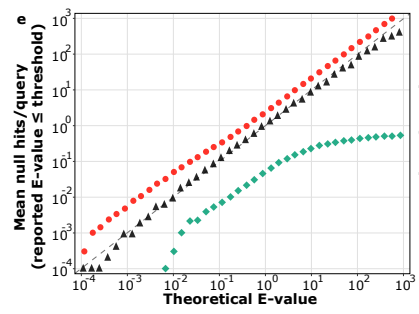
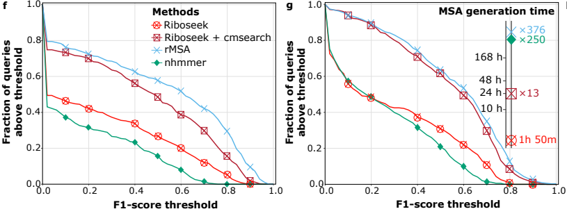

> **论文速览**：Park 等人在这篇 bioRxiv 预印本中提出 Riboseek，一款面向 RNA 和 DNA 的远缘同源搜索与比对工具。它通过重叠二联体编码和分阶段搜索，加速大规模数据库中的同源序列检索，为 RNA 结构预测生成多序列比对（MSA）。这项工作的关键，是在搜索速度、同源检出能力与比对质量之间取得更好的平衡。[^paper]

## RNA 结构预测的瓶颈，常常发生在模型之前

AlphaFold 3 和 Protenix-v2 已能预测包含 RNA 的生物分子结构，但预测能力也取决于输入信息。除查询序列外，模型还可以利用同源序列组成的 MSA，从中获取与共同结构约束相关的协变信号。要获得这些信息，往往需要先在 RNAcentral、NT 等大型数据库中搜索远缘同源序列，这一步可能比模型推理本身更耗时。

现有工具各有侧重，也各有代价：

- BLASTN 速度快，但依赖局部种子匹配，可能漏掉序列相似度较低的远缘同源物；
- nhmmer 使用谱隐马尔可夫模型（profile HMM）提高搜索敏感性，但搜索成本较高；
- Infernal 通过协方差模型（covariance model）利用 RNA 二级结构与序列协变信息，计算成本进一步增加；
- rMSA 结合多种搜索方法和结构感知过滤，生成的比对质量较高，但搜索大型数据库可能耗时数天。

这里的“敏感性”指同源检出敏感性：当数据库中确实存在远缘同源序列时，搜索工具把它们找出来的能力。

## Riboseek 的核心：用二联体保留局部上下文

常规核酸比对通常以单个碱基为编码单位。Riboseek 则把相邻两个核苷酸编码为一个二联体（di-mer）。

除 16 个标准二联体外，Riboseek 还引入 8 个通配二联体，允许二联体中的一个位置不指定具体碱基，用于处理序列末端以及模糊或非标准核苷酸。编码时，尿嘧啶与胸腺嘧啶采用相同映射，因此这套表示同时适用于 RNA 和 DNA。

*Riboseek 将查询序列编码为重叠二联体。*

### 如何把查询序列变成可搜索的 profile？

Rfam 收录了 RNA 家族及其序列比对。作者利用这些经过整理的比对，统计同一比对位置上二联体对的共现频率，再与各自的背景频率比较，得到对数优势比（log-odds）替换分数。相对于背景预期更常出现的组合得分较高，更少出现的组合得分较低。

搜索时，Riboseek 以一个碱基为步长，将查询序列编码为一系列二联体。替换矩阵随后给出每个查询二联体与各类目标二联体的匹配分数；这些分数沿查询位置排列，形成用于搜索的位置特异性评分矩阵（PSSM），即查询 profile。预筛选和后续的 Smith–Waterman–Gotoh 比对均以此为评分依据。

目标序列与查询序列可能方向相同，也可能呈反向互补关系，因此 Riboseek 会构建正向和反向互补两份查询 profile，分别搜索目标数据库。构建反向互补 profile 时，Riboseek 将每个目标二联体按其反向互补形式计分，例如 AC 按 GU（DNA 中为 GT）计分。后续迭代会将上一轮命中整理成以查询为中心的 MSA，并据此更新 profile，使下一轮搜索能够利用已检出同源序列提供的位点特异性信息。

*二联体替换矩阵为查询的每个位置提供评分，形成用于搜索的 profile。*

为避免数据泄漏，作者分别用训练集估计二联体替换矩阵、用验证集优化搜索参数，并在测试集比较工具性能。他们从 Rfam 14.10 的 4,170 个家族种子比对出发，以 80% 序列一致性为阈值去冗余，再按 Rfam clan 划分训练集、验证集和测试集，确保同一 clan 不跨集合。最终，143 个家族用于参数优化，155 个家族用于独立测试。

### Riboseek 如何在数据库中搜索？

构建 profile 后，Riboseek 通过四个阶段筛选并精炼结果：

1. **预筛选**：通过 k-mer 预筛选或 GPU 加速的无缺口预筛选（ungapped prefilter），快速找出与查询 profile 共享局部特征的候选序列，缩小后续比对范围。
2. **候选比对**：对候选执行 Smith–Waterman–Gotoh 局部比对，使用仿射缺口罚分，分别处理缺口的引入与延伸，在允许插入和缺失的条件下寻找局部匹配。
3. **迭代搜索**：将命中整理成以查询为中心的 MSA，再据此更新 profile，进入下一轮搜索，以提高远缘同源序列的检出率。
4. **结构感知重比对（可选）**：对于 RNA，可结合 MSA 与 RNAfold 预测的二级结构构建协方差模型，再调用 Infernal 的 CYK 算法重新比对命中，将碱基配对约束纳入比对过程。

*Riboseek 的分阶段搜索流程；结构感知重比对为可选步骤。*

## 搜索有多灵敏，生成的比对有多可靠？

### 1. 远缘同源检出能力与搜索速度

作者从 Rfam 测试集中选出 71 个成员数超过 20 的家族，并以每个家族中最长的序列作为查询。评估时，同家族序列作为真阳性；来自不同 clan 的序列和由真实序列随机打乱碱基顺序生成的对照序列作为假阳性；同一 clan 内其他家族的序列不参与评估。目标数据库共包含 96,701 条序列，作者还在每条目标序列的两端添加长度为 100–1,000 nt 的随机伪基因组片段，以模拟同源区域嵌在较长基因组序列中的情形。

主要指标是 ROC1-AUC：将命中排序后，出现在第一个假阳性之前的真阳性，占全部真阳性的比例。图中横轴为 ROC1-AUC 阈值，纵轴为达到该阈值的查询比例；颜色和符号区分不同工具，标记样式表示迭代次数。

*Rfam 基准中不同工具及迭代轮次的 ROC1-AUC 分布。同一工具的曲线越靠右上，表示整体同源检出能力越强。*

单轮搜索中，Infernal 的敏感性最高，Riboseek 次之，并优于 nhmmer、Smith–Waterman 和 BLASTN。随着 profile 逐轮更新，Riboseek、Infernal 和 nhmmer 的检出能力均有所提高。完成两次更新后，Riboseek 在大部分阈值范围内优于 nhmmer，并超过单轮 Infernal，但仍低于迭代后的 Infernal。

精确率–召回率（precision–recall）曲线提供了另一种观察角度：找回更多同源序列时，需要接受多少假阳性？Riboseek 整体优于 nhmmer、Smith–Waterman 和 BLASTN，但随着召回率提高，精确率也会下降。Infernal 在较高召回率下通常能保持较高精确率。

作者还用同一组查询搜索 RNAcentral v26，比较运行时间。GPU 版 Riboseek 首轮搜索不到两分钟，速度分别为 nhmmer 和 Infernal 的 544 倍和 777 倍，耗时为 BLASTN 的 2.9 倍。CPU 版使用 k-mer 预筛选，约 30 分钟完成相同搜索，速度分别为 nhmmer 和 Infernal 的 37 倍和 53 倍。

*精确率–召回率曲线展示检出率与假阳性之间的权衡；插图比较同一组查询搜索 RNAcentral 的耗时。*

DNA 基准使用 150 个 Dfam 家族，将家族成员作为真阳性，将由这些序列随机打乱碱基顺序生成的对照序列作为假阳性。ROC1-AUC 与精确率–召回率曲线均显示，Riboseek 的远缘同源检出能力优于 BLASTN、nhmmer 和成对 Smith–Waterman 比对。

*Dfam 基准中的同源检出表现：左为 ROC1-AUC 分布，右为精确率–召回率曲线。*

搜索结果的统计显著性是否可信，还需要检查 E-value 校准。作者另取 9,857 条 RNAcentral 序列，并生成随机打乱序列作为无真实同源关系的对照。若 E-value 校准良好，以 $x$ 为阈值时，每条查询平均应得到约 $x$ 个随机命中。Riboseek 和 BLASTN 的观测结果接近这一预期，nhmmer 的随机命中则更少，说明其 E-value 估计较为保守。

*E-value 校准：观测曲线越接近虚线 $y=x$，报告的 E-value 与随机命中数量越一致。*

### 2. MSA 能否保留二级结构信号？

除了检出同源序列，MSA 还需要保留与 RNA 结构相关的协变信号。在二级结构实验中，作者从 361 条非冗余 RNA 链的实验结构中提取参考碱基对。由于 rMSA 未能在 30 天内完成其中 15 条查询的 MSA 生成，最终只评测其余 346 条查询。

各工具均搜索 RNAcentral v26 和 NT，生成的 MSA 分别交给 R-scape 与 plmc 预测碱基对，再以实验结构中的碱基对为参考计算 F1 分数。这一设计直接检验 MSA 中的结构信号，而不只比较比对中包含多少条序列。

*二级结构评测：左为 R-scape，右为 plmc；曲线表示超过各 F1 阈值的查询比例，右侧插图为 MSA 生成耗时。*

在两种评估中，rMSA 的碱基对预测 F1 分数整体最高。Riboseek 的 MSA 经过 CYK 结构感知重比对后，F1 分数明显提高，接近但整体未超过 rMSA。不过，加入 CYK 结构感知重比对后，MSA 生成时间约为未使用时的 13 倍。CYK 重比对带来的提升也说明，比对方式会直接影响下游分析。

## 173 万份预计算 RNA MSA

作者从 RNAcentral 第 25 版下载全部序列，去除含缺口或非标准核苷酸的序列并完成去重。随后，他们用 EternaFold 预测每条序列的二级结构，只保留长度小于 600 nt、参与碱基配对的核苷酸比例至少为 60% 的序列。最终，Riboseek 为符合条件的 1,731,677 条 RNA 生成了 MSA。

作为参照，OpenFold3 发布的 RNAcentral 和 Rfam MSA 集合覆盖 126,778 条 RNA 序列。按所覆盖的 RNA 数量计算，Riboseek 集合约为其 13.7 倍。

## 如何看待 Riboseek 的贡献与局限？

Riboseek 的主要贡献，是把二联体表示、快速预筛选、局部比对与迭代搜索整合为可在 CPU 或 GPU 上运行的工具，显著降低大规模核酸同源搜索的时间成本。评测同时考察检出能力、精确率–召回率、E-value 校准、运行时间和二级结构信号。Rfam 数据按 clan 划分，避免同一 clan 的家族同时出现在训练集和测试集中。预计算 MSA 集合则提供了可直接复用的数据资源。

使用这些结果时，需要区分几层证据。首先，Rfam 和 Dfam 基准依赖已整理的家族标签与人工打乱的阴性序列，无法完全覆盖真实数据库中尚未注释或难以判定的同源关系。其次，更高召回率仍伴随假阳性增加，搜索阈值需要结合任务选择。最后，二级结构评测显示，结构感知重比对能显著改善 Riboseek 的 MSA，但比对质量与 rMSA 仍有差距。

因此，Riboseek 最值得关注的是大规模搜索的效率提升。实际应用中，需要同时权衡搜索耗时、命中可靠性和 MSA 质量。

[^paper]: Park, S. et al. “Fast remote nucleotide sequence alignment with Riboseek.” *bioRxiv*, 2026.07.31.741718v1. DOI: [10.64898/2026.07.31.741718](https://doi.org/10.64898/2026.07.31.741718). 这是一篇尚未经过同行评审的预印本。
